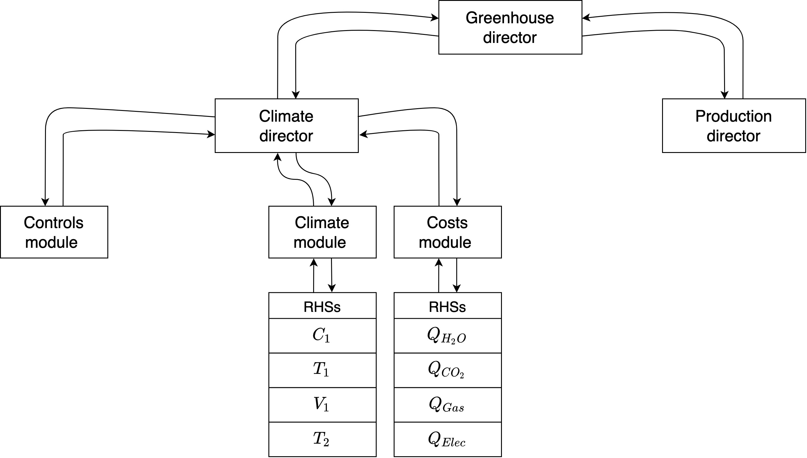

# *Greenhouse-ModMod*
El objetivo de este proyecto es la simulación de un invernadero utilizando el framework de programacón ModMod.

## 1. *Software*
### 1.1 Instalación
1. Instalar crear un ambiente virtual:
```bash
$ python3 -m venv GreenDev
```
Permite aislar los paquetes con las versiones necesarias el correcto
funcionamiento del software.
Documentacion de venv: https://docs.python.org/dev/library/venv.html

2. Activar el ambiente virtual:
```bash
$ source GreenDev/bin/activate
```
3. Instalar el software ModMod:
```bash
$ pip3 install git+https://github.com/jdmolinam/ModMod_Programming_environment.git
``````
4. Descargar el codigo fuente del modelo de reinforcement learning
```bash
$ git clone https://github.com/<github_user_name>/GreenhouseModMod/ --branch v02 --single-branch 
```
5. Instalar los paquetes requeridos
```bash
$ pip3 install -r GreenhouseModMod/requirements.txt 
```

## 2. Uso 
### 2.1 Entrenamiento con [DDPG](https://spinningup.openai.com/en/latest/algorithms/ddpg.html)
Para entrenar o probar redes solo se necesita ejecutar
```bash
$ cd GreenhouseModMod
$ python3 try_climate_only.py
```
Esto generara una carpeta con los resultados en el directorio simulation_results.

## 3. Parámetros
Se tienen diferentes tipos de parametros/constantes. Todos estan en la carpeta parameters

``` 3.1 parameters/parameters_ddpg.py ```
* **`VARS_OF_DIR`**: Lista de variables que tomara la red como entrada
* **`CONTROLS`**: Diccionario de controles, True significa encendico, False, apagado.
* **`hidden_sizes`**: Lista de la topologia de la red. 
* **`max_memory_size`**: Tamaño de la memoria.
* **`batch_size`**: Tamaño del batch utilizado para entrenar la red. 

```3.2 parameters/parameters_dir.py```
* **`minutes`**: Tamaño del paso del Runge Kutta.
* **`days`**: Número de dias por episodio
* **`season`**: Cadena que indica la temporada donde se tomaran los datos para entrenar. Debe estar definida en `read_dates.py`.

```parameters/parameters_env.py```
* **`EPISODES`**: Número de episodios a entrenar con ruido.
* **`SPECIALIZATION_PERIOD`**: Número de episodios a entrenear sin ruido. 
* **`N_TEST`**: Numero de episodios para probar la red. 
* **`TYPE`**: Cadena que indica la forma de tomar acciones(puede ser net(red), bwn(normal), unif(uniforme))
* **`SAVE_FREQ`**: Frecuencia de guardado de las redes 
* **`SEND_MAIL`**: Indica si debe enviar correo con los resultados 
* **`PATH_NET`**: Cadena con la ruta de red preentrenada, None para entrenar una nueva red 
* **`NET`**: Numero de red a usar, si no se tiene ninguna, Si `PATH_NET` es None, este parametro no es tomado en cuenta.

```parameters/modelo_fotosintesis.py```
* **`MODELO_FOTOSINTESIS`**: Controla el modelo que sera usado, detalles en `greenhouse/crop/README.md`.

## 4. Estructura y archivos relevantes

```bash
/ddpg
+- /ddpg.py
|   # Contiene el agente de DDPG y sus metodos para entrenar, disparar, cargar las redes.
|
+- /models.py
|   # Contiene los componente del agente, es decir actor/critic.
|
+- /utils.py
|   # Contiene la definicion del ruido como un proceso Ornstein–Uhlenbeck.
+-------------------------------------------------------------------------------------------------------
```


```bash
/ddpg
+- /ddpg.py
|   # Contiene el agente de DDPG y sus metodos para entrenar, disparar, 
|   # cargar las redes.
|
+- /models.py
|   # Contiene los componente del agente, es decir actor/critic.
|
+- /utils.py
|   # Contiene la definicion del ruido como un proceso Ornstein–Uhlenbeck.
+-------------------------------------------------------------------------------------------------------
```

```bash
/greenhouse
+- /climate
|    |
|    +- /*_rhs.py
|    |    # Son los lados derechos de las ecuaciones de clima.
|    |
|    +- /Decorador.py
|    |    # Contiene un decorador que permite revisar que los valores de 
|    |    # las funciones no tengan valores Nan.
|    |
|    +- /functions.py
|    |    # Contiene las funciones auxiliares del modulo de clima.
|    |
|    +- /module_*.py
|    |    # Contienen los sub-modulos del modulo de clima.
|    +-------------------------------------------------------------------------------------------------------
|
|-- /crop
|    |
|    |-- /*_rhs.py
|    |    # Son los lados derechos de las ecuaciones de crecimiento.
|    |
|    |-- /functions.py
|    |    # Contiene las funciones auxiliares del modulo de crecimiento.
|    |
|    |-- /module_*.py
|    |    # Contiene los modulos de fotosintesis y planta.
|    |
|    |-- /director.py
|    |    # Contiene la interfaz ModMod-DDPG.
|    +-------------------------------------------------------------------------------------------------------
```

## 5. *Greenhouse workflow*


