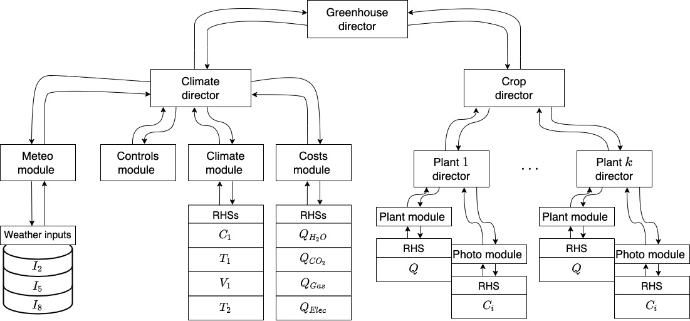

# Greenhouse-ModMod

This is a project about the simulation of a Greenhouse using the programming framework ModMod.

## Greenhouse workflow

## Software

### Libraries 
  * `ModMod`
  * `torch`
  * `scipy`
  * `numpy`
  * `reportlab`

### Instalation

### Tests

To simulate the full greenhouse enviorment (meteo module, climate + costs + control module and plant modules), execute the next
instrucion:

``
python3 try_climate_only.py
``

